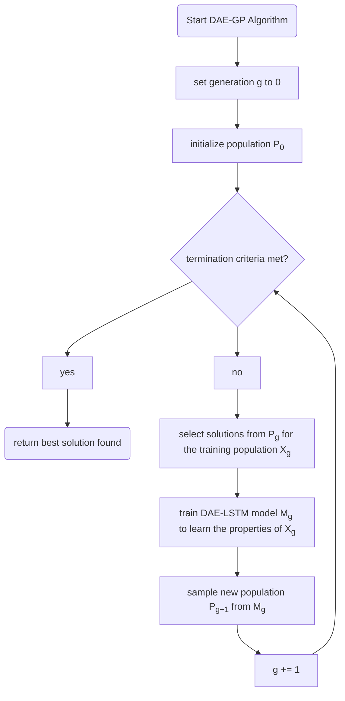

```mermaid {DAE-GP}
graph TD
a1(Start DAE-GP Algorithm)
-->
G[set generation g to 0] 
-->
A[initialize population P<sub>0</sub>] 
--> 
L{termination criteria met?}
    -->yes
        --> RET(return best solution found)
L{termination criteria met?}    
    -->no
            --> B[select solutions from P<sub>g</sub> for the training population X<sub>g</sub>]
            --> 
            C[train DAE-LSTM model M<sub>g</sub> to learn the properties of X<sub>g</sub>]
            -->
            D[sample new population P<sub>g+1</sub> from M<sub>g</sub>]
            --> 
            E[g += 1]
            -->
            L 

```