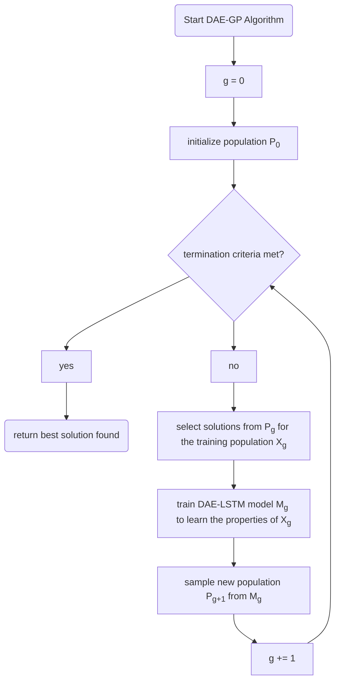

```mermaid {DAE-GP}
graph TD
start(Start DAE-GP Algorithm)
-->
init_gen[g = 0] 
-->
init_pop[initialize population P<sub>0</sub>] 
--> 
main_loop{termination criteria met?}
    -->yes
        --> return(return best solution found)
main_loop{termination criteria met?}    
    -->no
            --> selection[select solutions from P<sub>g</sub> for the training population X<sub>g</sub>]
            --> 
            model_building[train DAE-LSTM model M<sub>g</sub> to learn the properties of X<sub>g</sub>]
            -->
            model_sampling[sample new population P<sub>g+1</sub> from M<sub>g</sub>]
            --> 
            next_gen[g += 1]
            -->
            main_loop
```