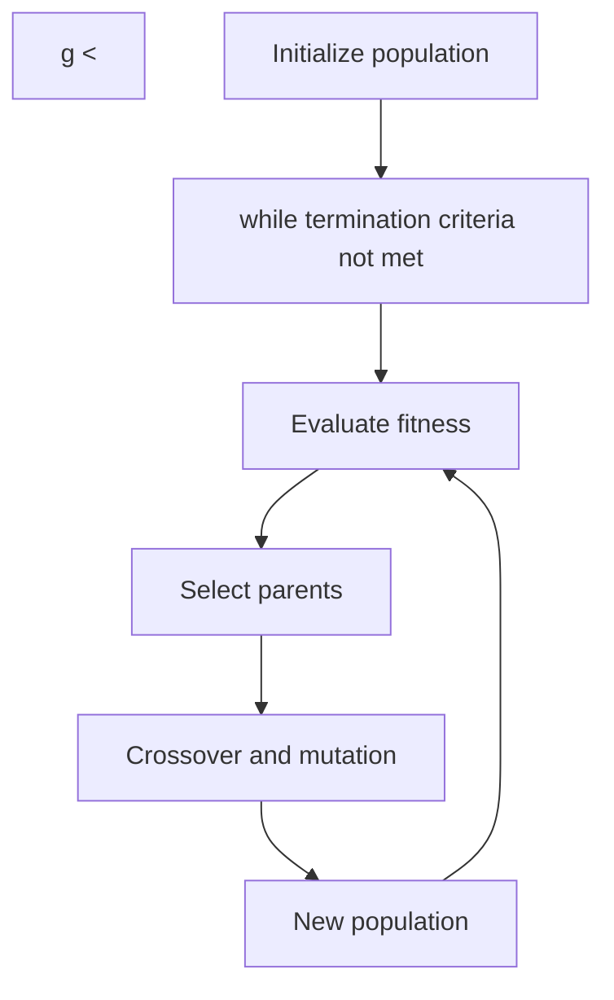

```mermaid {DAE-GP}
graph TD
G[g <]
A[Initialize population] 
A --> L[while termination criteria not met]
--> B[Evaluate fitness]
B --> C[Select parents]
C --> D[Crossover and mutation]
D --> E[New population]
E --> B

```