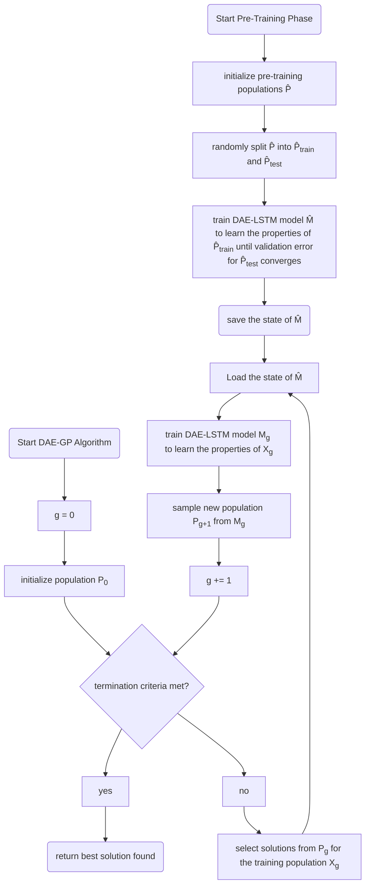

```mermaid {DAE-GP}
graph TD
pt_start(Start Pre-Training Phase)
-->
pt_init_pop[initialize pre-training populations P&#770] 
--> 
pt_split_pop[randomly split P&#770 into P&#770<sub>train</sub> and P&#770<sub>test</sub>]
-->
pt_model_building[train DAE-LSTM model M&#770 to learn the properties of P&#770<sub>train</sub> until validation error for P&#770<sub>test</sub> converges ]
-->
pt_model_return(save the state of M&#770)
start(Start DAE-GP Algorithm)
-->
init_gen[g = 0] 
-->
init_pop[initialize population P<sub>0</sub>] 
--> 
main_loop{termination criteria met?}
    -->yes
        --> 
        return(return best solution found)
main_loop{termination criteria met?}    
    -->no
        --> 
        selection[select solutions from P<sub>g</sub> for the training population X<sub>g</sub>]
        --> 
        model_loading[Load the state of M&#770]
        -->
        model_building[train DAE-LSTM model M<sub>g</sub> to learn the properties of X<sub>g</sub>]
        -->
        model_sampling[sample new population P<sub>g+1</sub> from M<sub>g</sub>]
        --> 
        next_gen[g += 1]
        -->
        main_loop
pt_model_return --> model_loading
```